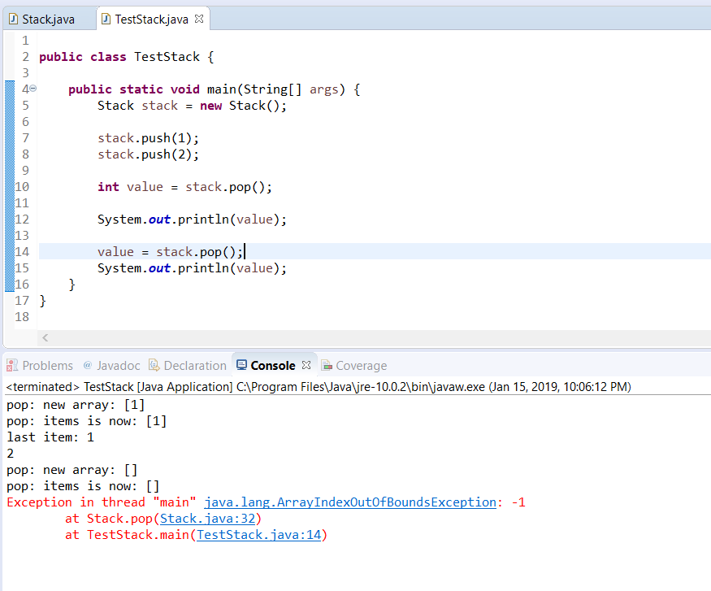
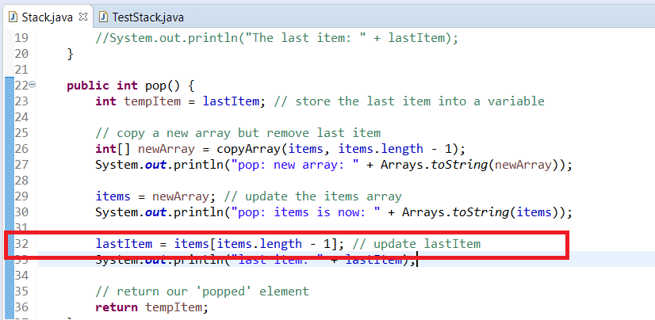

# Exercise 1

Instead of creating code in the push method to copy an array write a private method in the class to return an int\[\] that is a copy of another based on a specified length. You can use the following signature:

```java
    private int[] copyArray(int[] array, int length)
```

If you get stuck: we've provided a solution in the **References** section of this activity.

After you're done, your push method should look like the following:

```java
    public void push(int newItem) {
    
      int index = items.length; // get current length to store as index
      System.out.println("The array length is: " + index);
    
      items = copyArray(items, items.length+1); // increase the array by 1
      System.out.println("items after extending the length by 1: " + Arrays.toString(items));
    
      items[index] = newItem; // store the value in the index
      System.out.println("items after storing the new value: "+ Arrays.toString(items));
    
      lastItem = newItem; // update lastItem
      System.out.println("The last item: " + lastItem);
    }
```

Re-run your TestStack class and you should find that push works properly. But...pop() is still returning 2 twice.

#2
--

Follow the same process that we did with `push()` to diagnose the issue and refactor the code so that it returns the correct value. If you get stuck we've provide a solution in the References section of this activity.

Upon further inspection you'll find that the `pop()` method is implemented correctly, only that in main we never updated value to the new pop(). It is a simple fix that we can make to print the other value.



  
 

Unfortunately, we run into one more issue. The above image shows an `ArrayIndexOutOfBoundsException`. Recall that you run into these issues if you try to access an element outside of the boundaries of an array. If we inspect line 32 of Stack, we'll see the following:



Here you can see that we're trying to update the lastItem, but in this case the array size is now 0. We can't access the -1 element.

To fix this we can write a simple if-statement to check if the current array size is 0, if so, then we'll set lastItem to -1. (There is no significance of -1 here, we're just picking it since the other values are positive).

    public int pop() {
    
      int tempItem = lastItem; // store the last item into a variable
    
      // copy a new array but remove last item
      int[] newArray = copyArray(items, items.length - 1);
      //System.out.println("pop: new array: " + Arrays.toString(newArray));
    
      items = newArray; // update the items array
      //System.out.println("pop: items is now: " + Arrays.toString(items));
    
      if (items.length == 0) {
        lastItem = -1; //set lastItem to -1
      }else {
        lastItem = items[items.length - 1]; // update lastItem
      }
      //System.out.println("last item: " + lastItem);
    
      // return our 'popped' element
      return tempItem;
    }

  
 

With that last update you can re-run the TestStack class, and you'll find that you successfully push() and pop() elements into our Stack.

#3
--

Implement the `peek()` functionality of a Stack into the class here. If you get stuck you can check the Reference section for ideas.

  
 

> SOMETHING TO THINK ABOUT
> 
> As part of this lab, we initialized the int\[ \] with a length of 0. It can be a costly operation (in terms of performance) to dynamically grow and shrink an array like we did for common operations like push() and pop().
>Another approach is to initialize the array with a larger value, say 16 or 100. Thus that memory is already allocated for your data and you would only need to track where in the array that you're currently looking at.
Think about how you would change your Stack class to support this approach.
That completes this exercise.