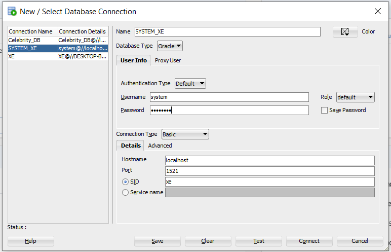
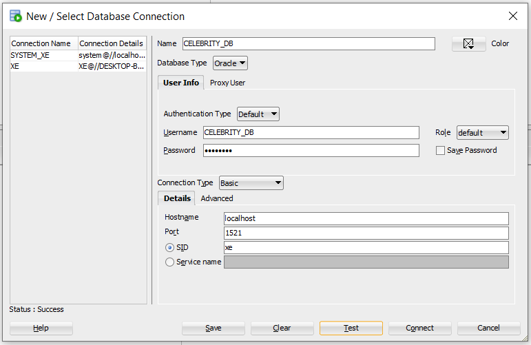

# JDBC Examples
The code examples are located under the `jdbc-local` folder organized as a Maven project.
**Currently, this project is using a Java 8 environment.**

## Overview
Currently there is one example:
* Celebrity example
  * JDBC
  * DAO
  * (Assumes basic familiarity with Oracle/RDMS's and SQL) 

## Setup: 

**Background**

Ensure that you can set up the JDBC-Local Maven Project in Eclipse: 

1. Clone the repo. (You likely have already done this.) 
2. Ensure Maven is properly installed on your machine. 
	1. Download and install from [here](https://maven.apache.org/download.cgi). Installation instructions can be found [here](https://maven.apache.org/install.html) - though essentially you simply unzip the folder. 
	2. Set your environment variables.
3. From the commandline, use Maven to install ojdbc7. 
	```
	cd java-standard-examples/jdbc-local
	```
	Then install Oracle ojdbc7 file: 
	(**Note** that the jar file can be found /jdbc-local/src/main/resources/ojdbc7-12.1.0.2.jar)

	Replace "Path_to..." with the actual path. 
	```
	mvn install:install-file -Dfile="PATH_TO_ojdbc7-12.1.0.2.jar" -DgroupId=com.oracle -DartifactId=ojdbc7 -Dversion=12.1.0 -Dpackaging=jar
	```
	- Alternatively, if you have problems with your Maven installation auto-installing the jar file you can manually create the following folder structure in your .m2 Repository and manually move the jar into it's correct location. `com\oracle\ojdbc7\12.1.0.2`
4. From Eclipse: Import>Existing Maven Projects. Then for the `Root` library navigate to the java-standard-example folder.  
	- Of course, for good measure run both `Project> Clean` and `Run As> Maven Clean` as soon as you finish importing the project.  

**Database Install**

Install needed software for a local Oracle database.

1. Install the Oracle XE database. Found [here](https://www.oracle.com/database/technologies/xe-downloads.html).
	- Note that Oracle Enterprise Edition is only available on Windows Server. Oracle XE is the Edition intended for students/Windows Home users. 
	- Helpful info can be found [here](https://www.oracle.com/database/technologies/appdev/xe.html). Including a link to an easy to follow instructional video.
	- Additional instructions on Oracle can be found [here](https://docs.oracle.com/cd/E17781_01/admin.112/e18585/toc.htm)- though this link is for a slightly older version of the database. 
	- **Be sure to take note of the connection string and the password you establish for the system user when installing the RDBMS.**
2. The next step is to install SQL Developer to help ease interacting with your Oracle database. You can download that [here.](https://www.oracle.com/tools/downloads/sqldev-downloads.html)
	- After you download and unzip the installation folder it may automatically detect your database and allow you to create a connection from menu on the opening page. 
	- Otherwise, you will go to manually add a connection by clicking on the green plus sign next to connections, and you will establish the connection as the system user. 
	
	- Assuming you stuck to the default settings, your connection will be on port 1521 and your SID is XE. 
	- Test it and then connect. 

After setting up your project in Eclipse you and installing your local RDBMS. You'll need to set up your CELEBRITY_DB and its tables. 

## How to teach

### Step 0

Be sure your students have all necessary software properly installed. 

Mention, if not demo, these initial setup steps. 

**Database Setup**

Under your System_XE connection, run the following commands to create the CELEBRITY_DB. Then you will create another connection and run the commands to set up your tables through the CELEBRITY_DB user. 

```sql
CREATE USER CELEBRITY_DB IDENTIFIED BY password;
GRANT CONNECT, RESOURCE TO CELEBRITY_DB;
GRANT DBA TO CELEBRITY_DB;
```
(Note you may need to run `alter session set "_ORACLE_SCRIPT"=true;` in order to do away with the container prefix before newly created users. Only do this if you get an error running your CREATE USER statement.)

Then create a connection using the new credentials: 


(In published code include these commands in the resources script.)

### Step 1
Create the table in the `CELEBRITY_DB` database. Use the `setup-celebrity-tables.sql` code in the `jdbc-local\src\main\resources` folder. 

Be sure and note the types of each field, so you can highlight how they are compatible in the `Celebrity` class you create. 

### Step 2
Create the `Celebrity` class and fill with fields and methods to mirror the `CELEBRITY` table.

### Step 3
Create the `ConnectionUtil` class. Highlight the corresponding ojdbc dependency to the `pom.xml`. 

### Step 4
Fill the `ConnectionUtil` class with necessary information while explaining the `Connection` interface and the `DriverManager` class. Create the `getConnection()` method and test it with the main method.

### Step 5
Create the `CelebrityRepository` interface and explain the DAO design pattern. Add the abstract methods into the interface.

Leave `insertProcedure` commented out for now. 

### Step 6
Create the `CelebrityRepositoryJdbc` class and implement the `CelebrityRepository` interface.

### Step 7
Implement the `selectAll()` method with a `Statement`. Explain the drawbacks with using this type of statement.

### Step 8
Implement the `findByUsername()` or `insert()` methods with a `PreparedStatement`. Explain the safeguards that are built in to the `PreparedStatement` and notable improvements.

### Step 9
Create a stored procedure in the db. Run the `setup-stored-proc.sql` statements in the database. 

Then uncomment and implement the `insertProcedure()` method. Explain the syntactical and usage differences between a callable and a prepared statement.

### Step 10
Create the `CelebrityDataAccessTest` class in `src/test/java` and demonstrate to associates how to test the dao layer.


