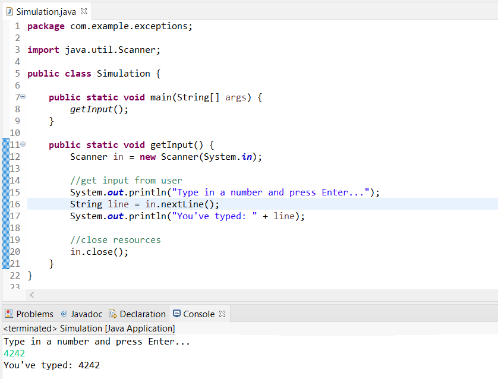
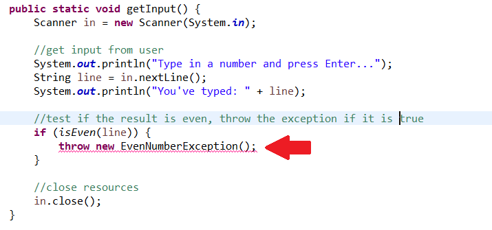

# Creating Exceptions

## Objectives

* Create a custom exception
* Write code to handle a custom exception
* Write a custom message when the exception occurs
 
## Background

Recall that an `Exception` is a specific subclass of `Throwable` and it represents all possible exceptions. Exceptions are classified as either checked or unchecked exceptions. The class `RuntimeException` is the parent class of all unchecked exceptions.

You must handle any checked exception in code by either using a `try/catch/finally` block or by declaring that a method throws the exception by using the `throws` keyword.

## Instructions

In this exercise, you'll create a custom exception and work through handling it in code. We'll write a simple scenario in which a user provides some given input and if the number is even, we'll throw a custom exception. In this world, we don't like even numbers.

### Project Setup
-------------

1.  Open your IDE (Eclipse), and select File > New > Java Project. 

2.  Provide the name, **Lab-Exceptions** and click Finish.
    
    a. If a window displays to create a module-info.java file then click **Don't Create**. 

3.  Right-click on the newly created project and select New > Package.

4.  Provide the package name, **com.example.exceptions** and click Finish.

5.  Right-click on the new package and selected New > Class. Provide the class the name, **EvenNumberException** and click Finish.

6.  Now edit the file so that it `extends` the `Exception` class. Your file should look like the following:    

```java
package com.example.exceptions;

public class EvenNumberException extends Exception{

}
```

That's all we need now for this class.

> If your IDE underlines your class indicating a warning, suggesting to provide a serial version ID, then you can ignore that for this lesson. 

Next, create a class, **Simulation**, in the same package and provide a `main` method. Your new class should look like the following:

```java
package com.example.exceptions;

public class Simulation{

    public static void main(String[] args){
 
    }
}    
```

In this class, we'll create a method `getInput()` which will use a `Scanner` to solicit user input. Add the following code to the `Simulation` class:

```java
package com.example.exceptions;

import java.util.Scanner;

public class Simulation {

    public static void main(String[] args) {
        getInput();
    }

    public static void getInput() {
        Scanner in = new Scanner(System.in);

        //get input from user
        System.out.println("Type in a number and press Enter...");
        String line = in.nextLine();
        System.out.println("You've typed: " + line);

        //close resources
        in.close();
    }
}
```

> We've made the method `static` so that we won't need an instance of Simulation in order to invoke it.

> Make sure to `import` the Scanner class from the `java.util` package. 

Notice that we've used a couple of `System.out.println` statements to indicate what state the program is in (either it is waiting on user input or not).

Run the program.

Type in any numerical value, say 4242 and hit Enter/Return.

> You may have to click in the console area of your IDE in order to provide input. 

You'll see a result like the following:



Next, let's write another method, one which will return a boolean based on if the number is even or not. We'll call the method `isEven`.

Update your code to the following:

```java
package com.example.exceptions;

import java.util.Scanner;

public class Simulation {

    public static void main(String[] args) {
        getInput();
    }

    public static void getInput() {
        Scanner in = new Scanner(System.in);

        //get input from user
        System.out.println("Type in a number and press Enter...");
        String line = in.nextLine();
        System.out.println("You've typed: " + line);

        //close resources
        in.close();
    }

    public static boolean isEven(String num) {
        //convert value to a number
        int value = Integer.parseInt(num);

        return (value % 2 == 0);
    }
}
```

> Converting `String` to `int` 
>
>The line `int value = Integer.parseInt(num)` is a statement used to convert the input value, which is a String, to an integer value. The class `Integer` provides some utility methods that you can use to convert a String to a number. Other classes, such as Double, Long and Float, do so as well. They all take the format of `parseXYZ(String s)` where XYZ stands for Integer, Double, Long, etc. In this case we are converting a `String` to an `int`, so we'll use the `Integer.parseInt(..)` method.

Instead of using an if-statement, we've created a boolean expression using parenthesis and returned the value of the expression. It checks if the remainder from dividing the number by 2 is equal to 0. It returns `true` if the result is 0 and `false` otherwise.

Now, we can use this function within our `getInput` function and throw our custom exception if the returned value is `true`. 

## Throwing the Exception

In order to throw our exception, we'll use the `throw` keyword. 

Update your code to resemble the following:

```java
package com.example.exceptions;

import java.util.Scanner;

public class Simulation {

    public static void main(String[] args) {
        getInput();
    }

    public static void getInput() {
        Scanner in = new Scanner(System.in);

        //get input from user
        System.out.println("Type in a number and press Enter...");
        String line = in.nextLine();
        System.out.println("You've typed: " + line);

        //test if number is even, throw exception if true
        if (isEven(line)) {
            throw new EvenNumberException();
        }

        //close resources
        in.close();
    }

    public static boolean isEven(String num) {
        //convert value to a number
        int value = Integer.parseInt(num);

        return (value % 2 == 0);
    }
}
```

Save the file.

## Handling the Exception

In your Editor, you'll see our line is underlined in red where we throw the exception.



The reason our code is underlined is that we need to handle the exception in some manner.

One way to handle this is to specify that our method will re-throw the exception and let some other code handle it. We can use the `throws` keyword to indicate that our method throws the exception. 

Update the method signature to use the `throws` keyword:

```java
package com.example.exceptions;

import java.util.Scanner;

public class Simulation {

    public static void main(String[] args) {
        getInput();
    }

    public static void getInput() throws EvenNumberException{
        ...
    }

    ...
}
```

So now our `getInput` method is fine, but the `main` method has an issue where we invoke `getInput`.


Instead of just specifying that our `main` method re-throws the exception, we'll handle it by using a try/catch block.

Update your code to surround `getInput` with a try/catch block like the following:

```java
package com.example.exceptions;

import java.util.Scanner;

public class Simulation {

    public static void main(String[] args) {
        try {
            getInput();
        } catch (EvenNumberException e){
            e.printStackTrace();
        }
    }
    ...
}
```

> Within the `catch` block we've called `e.printStackTrace()`. The stack trace is the log of messages and code that was invoked up until the exception occurred. When running into exceptions, the stack trace is useful for debugging errors and pinpointing where in your code the error is. In this scenario, the error is fictitious as we don't like even numbers.

Run your program.

Input an odd number, say `1`. Hit Enter.

You'll see output like the following:


Our program behaves normally.

Re-run the program.

Input an even number this time, say 2.

You'll see output like the following:


There are a couple things to point out in this image.

First, any text in blue (`eg: Simulation.java:25`) is a hyperlink to the indicated file and line that last executed before the exception occurred. 

Secondly, the topmost line beginning with "at", is the last line of code that executed before our exception occurred. In this case, line 25 of `Simulation.java` executed before the exception occurred. Line 25 is where we use the `throw` keyword to throw the exception. 

## Closing Resources

You may notice a yellow line beneath the code where we throw a new EvenNumberException. Upon further inspection, your IDE may report on a possible resource leak.


As a good coding practice, you should get in the habit of closing resources when you open them. In this case, we actually have a call to the `close()` method, but because we threw our exception beforehand, that code is never executed.

To address this, we'll refactor the code to use a `try/catch/finally` block here and add a `close` method inside of the `finally` block. Since we'll handle the exception within this method, we'll remove the `throws` clause and the try-block from the `main` method. 

Update your code `getInput` method to resemble the following:

```java
    ...
    public static void main(String[] args) {
        getInput();
    }

    public static void getInput() {
        Scanner in = new Scanner(System.in);

        //get input from user
        System.out.println("Type in a number and press Enter...");
        String line = in.nextLine();
        System.out.println("You've typed: " + line);

        //test if the result is even, throw the exception if it is true
        if (isEven(line)) {
            try {
                throw new EvenNumberException();
            }catch (EvenNumberException e) {
                e.printStackTrace();
            }finally {
                in.close();
            }
        }
            
        //close resources
        in.close();
    }
    ...
```

> You don't need a catch-block to use a try-block, however, you cannot have a try-block without either a catch-block or a finally-block.

> Another way to handle closing resources is by using a try-with-resources block instead of the version above. 

You can re-run your program and it should work the same way as before.

## Adding a Custom Message

Throwable (the parent class of Exception) provides a `getMessage` method that you can override to provide a user-friendly message whenever the exception occurs.

Update the EvenNumberException class to the following:

```java
package com.example.exceptions;

public class EvenNumberException extends Exception{
    @Override
    public String getMessage() {
        return "You cannot input an even number.";
    }
}
```

Save the file and re-run the Simulation class again.

Input an even number.

You'll see output with your custom message.


This concludes this lab.