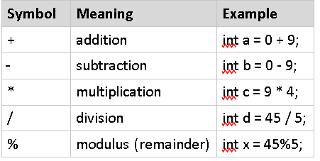
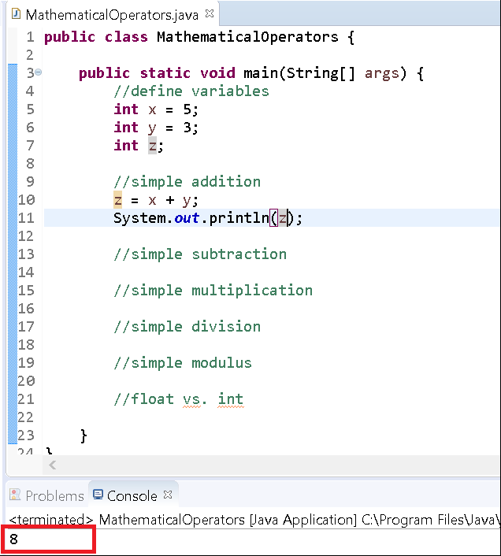
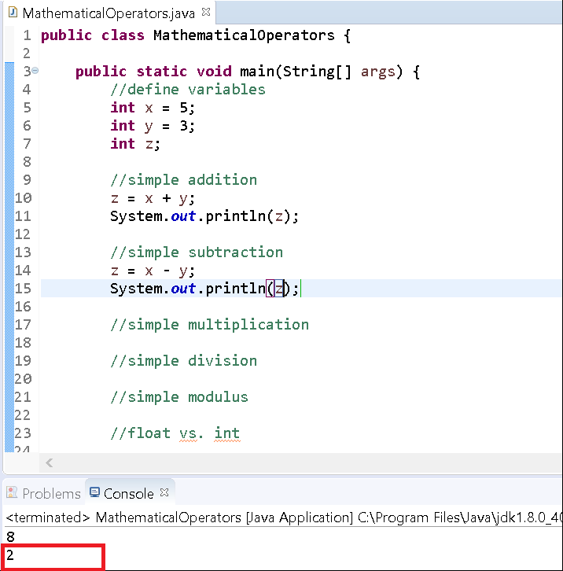
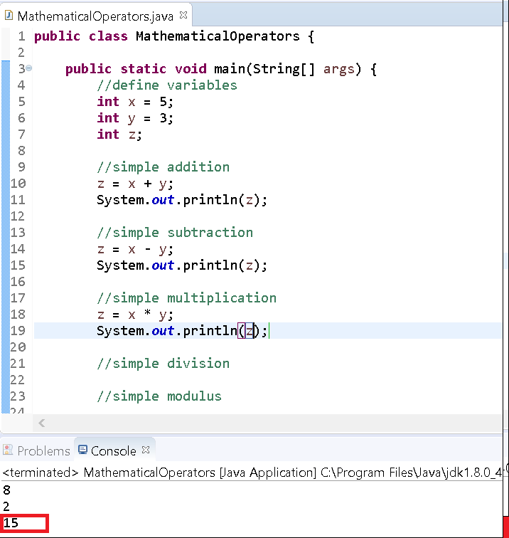
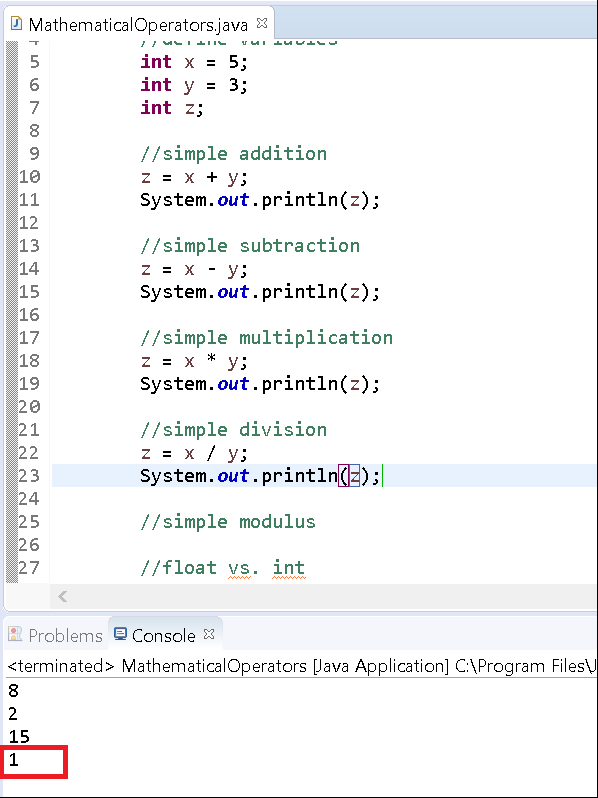
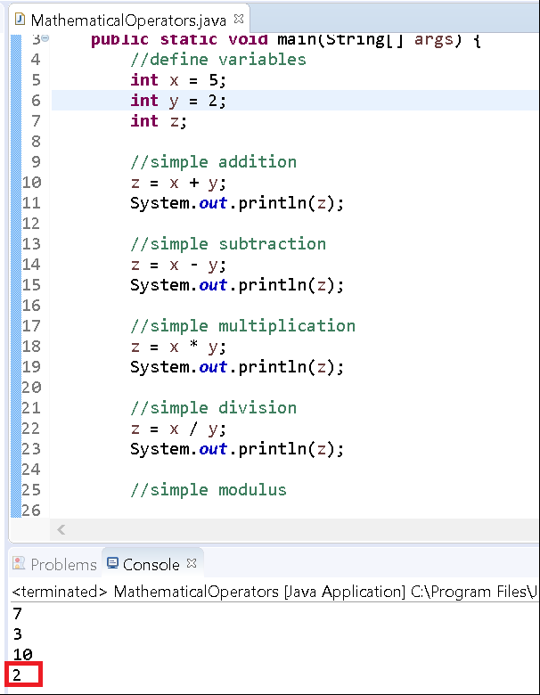
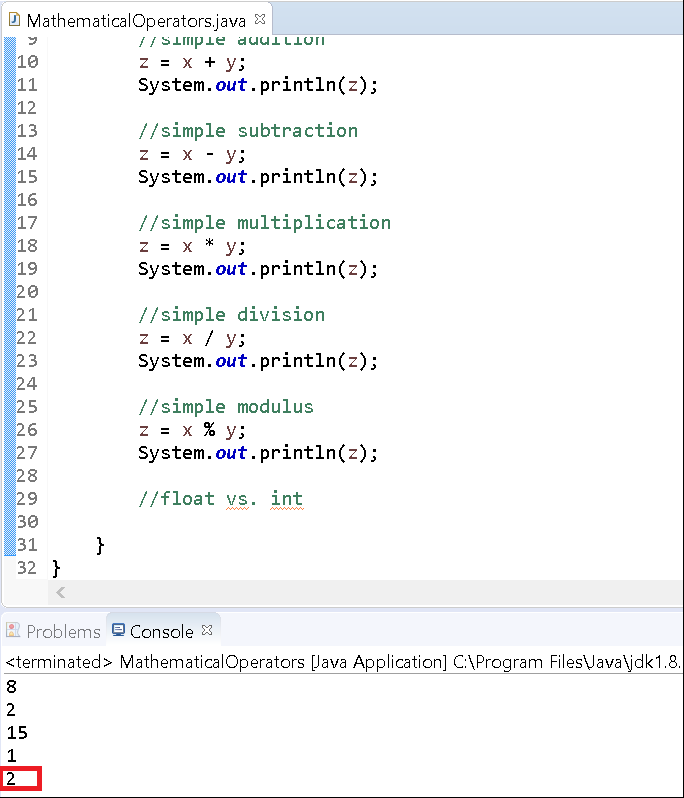
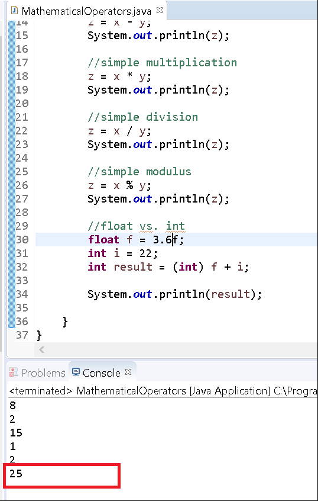
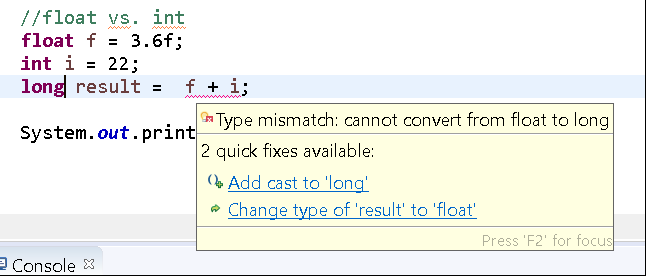
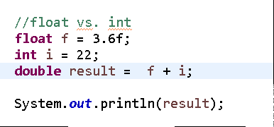

# Writing Simple Math Statements

## Background

In this exercise, you'll practice using mathematical operators and exploring their effect on different data types.

Recall the different mathematical operators and their meaning:

Instructions
============

Project Setup
-------------

1.  Open your IDE (Eclipse), and select File > New > Java Project.
    
2.  Provide the name, Lab-MathematicalOperators and click OK.
    
3.  Right-click on the newly created project and select New > Class.
    
4.  Provide the class the name, MathematicalOperators and click OK.
    
5.  Now edit the file so that it looks like the following:
    

public class MathematicalOperators {  
  
 public static void main(String\[\] args) {  
//define variables  
int x = 5;  
int y = 3;  
int z;  
  
  
//simple addition  
  
//simple subtraction  
  
//simple multiplication  
  
//simple division  
  
//simple modulus  
  
//float vs. int  
  
 }  
  
}

Note that the above code includes comments. A comment is a line or multiple lines of code that are NOT processed by the compiler. That are used to write notes in your code for yourself or other developers.

To create a single-line comment, start a line with a double forward slash (//):

// an example of a single-line comment

To create a multi-line comment, start a line with /\* and end your comment with \*/. You can place this type of comment anywhere and surround any number of lines:

/\* an example of a multi-line comment \*/  
  
/\* This is  
   another example  
  of a multi-line  
   comment \*/

Addition
--------

Now edit the file to output a simple addition statement

public class MathematicalOperators {  
  
 public static void main(String\[\] args) {  
//define variables  
int x = 5;  
int y = 3;  
int z;  
  
//simple addition  
z = x + y;  
System.out.println(z);  
  
//simple subtraction  
  
//simple multiplication  
  
   //simple division  
  
//simple modulus  
  
//float vs. int  
  
 }  
}

Run the program.

You'll see output like the following

Subtraction
-----------

Edit the file so that you use the minus operator to create a subtraction statement.

public class MathematicalOperators {  
  
 public static void main(String\[\] args) {  
//define variables  
int x = 5;  
int y = 3;  
int z;  
  
//simple addition  
z = x + y;  
System.out.println(z);  
  
//simple subtraction  
z = x - y;  
System.out.println(z);  
  
//simple multiplication  
  
//simple division  
  
//simple modulus  
  
//float vs. int  
  
 }  
  
}

Run the program.

You'll see the output of the statement.

Multiplication
--------------

Use the \* symbol to create a multiplication statement.

public class MathematicalOperators {  
  
 public static void main(String\[\] args) {  
//define variables  
int x = 5;  
int y = 3;  
int z;  
  
//simple addition  
z = x + y;  
System.out.println(z);  
  
//simple subtraction  
z = x - y;  
System.out.println(z);  
  
//simple multiplication  
z = x \* y;  
System.out.println(z);  
  
//simple division  
  
//simple modulus  
  
//float vs. int  
   
 }  
}

Run the program.

You'll see the output of your multiplication statement

Division
--------

Use the / operator to create a division statement.

public class MathematicalOperators {  
  
 public static void main(String\[\] args) {  
//define variables  
   int x = 5;  
int y = 3;  
int z;  
  
//simple addition  
z = x + y;  
System.out.println(z);  
  
//simple subtraction  
z = x - y;  
System.out.println(z);  
  
//simple multiplication  
z = x \* y;  
System.out.println(z);  
  
//simple division  
z = x / y;  
System.out.println(z);  
  
//simple modulus  
  
//float vs. int  
  
 }  
  
}

Run the program.

You'll see the output of 1. Notice that the result is rounded to the nearest integer.

Change the value of y to 2.

Re-run the code and you'll see the output of your division statement has changed to 2.

Change the value of y back to 3.

Modulus
-------

Now we'll use the % operator to create a modulus statement.

public class MathematicalOperators {  
  
 public static void main(String\[\] args) {  
//define variables  
int x = 5;  
int y = 3;  
int z;  
  
//simple addition  
z = x + y;  
System.out.println(z);  
  
//simple subtraction  
z = x - y;  
System.out.println(z);  
  
//simple multiplication  
z = x \* y;  
   System.out.println(z);  
  
//simple division  
z = x / y;  
System.out.println(z);  
  
//simple modulus  
z = x % y;  
System.out.println(z);  
  
//float vs. int  
  
 }  
  
}

Run the program.

You should see the remainder of 5 / 3, which is 2.

Performing Operations on different datatypes
--------------------------------------------

Next, we'll test how mathematical operators behave when using different datatypes.

Add the following lines to your file under the line "//float vs int.":

float f = 3.6f;  
int i = 22;  
int result = f + i;  
  
System.out.println(result);  
 

Notice that a red squiggly line appears on our addition statement. This indicates a compiler error. If you hover your mouse cursor over the red line, you'll see a more in-depth description of the error.

This error occurs because we're trying to save the result of a float added to an int to an int variable. Recall that a float is a 32-bit floating-point number and an integer is a 32-bit integer. We'll potentially lose the precision of our data (the decimal places) if we store a floating-point number as an integer, so the compiler complains by default.

If you add a cast to the result, however, then you're telling the compiler that you know what you're doing and it is safe to truncate the value to an integer. (Essentially, you're rounding the result to the nearest whole number).

So, let's add a cast and we'll see the error disappear.

float f = 3.6f;  
int i = 22;  
int result = (int)f + i;  
  
System.out.println(result);

Run the program.

You'll see that the result is 25 (which is 22 plus 3.6). Notice we have dropped any decimal places and the number isn't rounded up.

### What happens if we perform the same operation but use a larger datatype?

Change the datatype of result to a long and save the file. Notice the red squiggly line reappears. Although long is 64-bits, it doesn't have the same precision as a float (floating-point number) and thus you have to specify a cast if you want to perform this operation.

Now change the datatype of result to be a double. Notice this is acceptable and no red line appears. This is because a double can support the precision of the sum of an int and a float.

Congratulations! You've reached the end of this lab.
