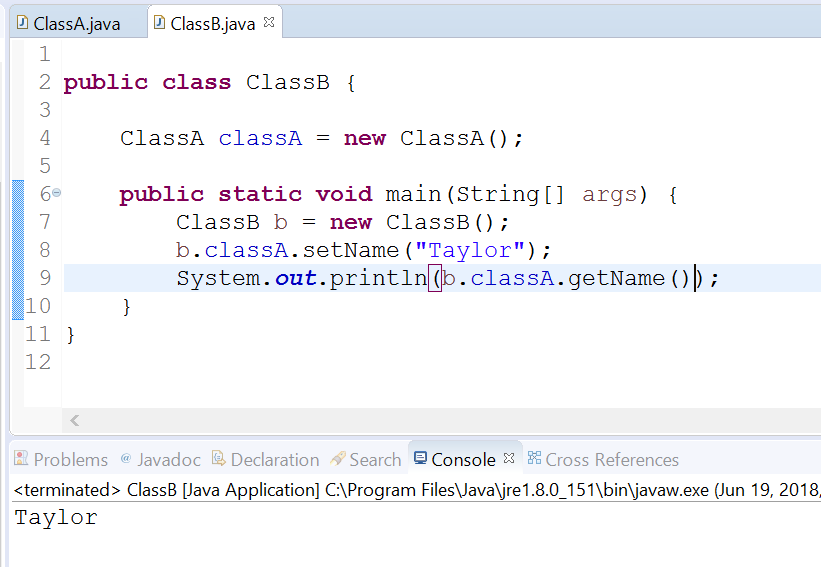

# Writing Composite Classes

## Background

A class can declare another as an instance variable and this creates a **composite** relationship between the two.

For example, say you have the following class

```java
public class ClassA{
    String name = “name”;
}

public class ClassB {
    ClassA classA;  //declare an instance variable of type ClassA
}
```

In the above code, we have two classes, ClassA and ClassB. ClassB has a composite relationship with ClassA.

## Guided Practice

Now that we have some background on composite relationships we'll walk through creating classes that interact with one another.

Follow the instructions below to set up a new project. 

### Project Setup

Open your IDE (Eclipse), and select File > New > Java Project.

Provide the name, Lab-CompositeRelationships and click OK.

(Select "Don't Create" if a window comes up asking to "Create a module-info.java" file.)

Right-click on the newly created project and select New > Class.

Provide the class the name, ClassA and click OK.

Now edit the file so that it looks like the following:

```java
public class ClassA {

    String name = “name”;

    public void setName(String name){ this.name = name; }

    public String getName() {return name; }
}
```

Excellent, now create another class, ClassB and edit the file so that it declares ClassA as an instance variable.

```java
public class ClassB {
    ClassA classA = new ClassA();
}
```

Now, create a main method in ClassB.  

In the main method instantiate a new ClassB object.

```java
public class ClassB{

    ClassA classA = new ClassA();

    public static void main(String[] args) {
        ClassB b = new ClassB();
    }
}
```

Since ClassB has a reference to ClassA, we can use the instance of ClassB to execute accessible methods from ClassA.

Next, use the reference variable b and the dot-operator to access its reference to ClassA and call the `setName` and `getName` methods.

```java
public class ClassB{

    ClassA classA = new ClassA();

    public static void main(String[] args) {
        ClassB b = new ClassB();
        b.classA.setName("Taylor");
    
        System.out.println(b.classA.getName());
    }
}
```

Save the file and run the program.

You’ll output like the following.



This concludes the lab. 