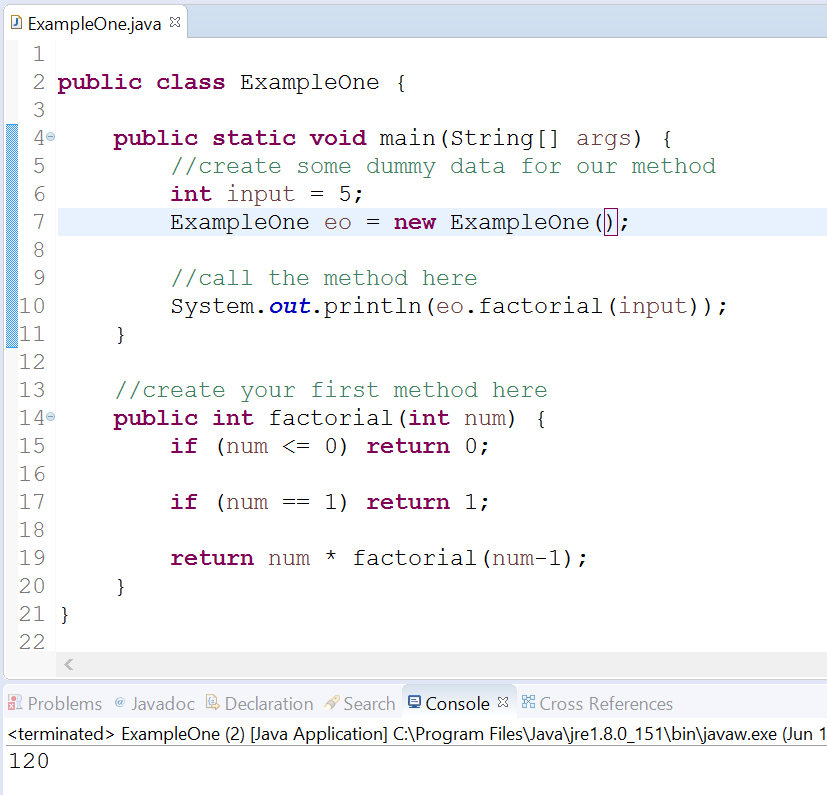

# Writing Recursive Algorithms

## Objectives

* Explore how to write an algorithm that is recursive.
    
## Background

Recall that a recursive algorithm is one that "calls itself" or "a method with the same name". In terms of methods, you'll write one and inside of that  method you'll call the same method. The trick is that the inner call to the method will be on a data set that is smaller and thus eventually it will end successive calls and not make an infinite stack of calls to the same method over and over again.

## Guided Practice

Follow the instructions below to setup a sample project to practice writing a recursive method. 

### Project Setup

Open your IDE (Eclipse), and select File > New > Java Project.

Provide the name, Lab-Recursion and click OK.

Right-click on the newly created project and select New > Class.

Provide the class the name, ExampleOne and click OK.

Now edit the file so that it looks like the following:

```java
public class ExampleOne {

    public static void main(String\[\] args) {
        //create some dummy data for our method

        //call your methods here
    }

    //create your first method here
}
```

So let's create a recursive algorithm for calculating the factorial of a number. Recall that a factorial or N! is calculated as the sum of n \* (n-1) \* (n-2) \* (n-3),.. \* (n-(n-1)). The calculation easily lends itself to a recursive function because you can simply multiply the number with one less than it until you reach the value of 1.

So let's create a public method that returns a whole number (`int`), is called `factorial`, and can accept a single `int` parameter.

The method signature will be thus:

```java
public int factorial(int num)
```

When writing recursive functions we should think about a base case or cases. What input would return a value directly as opposed to generating another call to the recursive function? Well, 1 (one) is one such value. If someone wants the factorial of 1, we simply return 1. This is our base case.

For fullness, we can error-proof our method to also return a value in case someone passed in zero or less (since both are valid `int` values). In that case we can also add a base case if the parameter is zero or less.

> **NOTE**: In conventional mathematics 0! is 1 and negative numbers are not calculated in the factorial equation. We'll simply return 0 in our method. 

Adding the base cases, our method would resemble such:

```java
public int factorial (int num) {
    if (num <= 0) return 0;
    if (num == 1) return 1;

}
```

Great! So that takes care of our base case. Now we should focus on the recursive call. Thinking back to the definition of factorial, it is n \* (n-1) \* (n-2) \* … (n - (n - 1)). The last case would equal one, which is our base case. So we need to multiple the current number, n, by one less than it (and the corresponding consecutive numbers). We can think of the chain as a call to our function, factorial, but passing in one less than the current number. Since 5! = 5 \* 4!, 4! = 4 \* 3! and so on. 

Thus our recursive call can be written as such:

```java
return num \* factorial(num-1);
```

So now, our entire function would resemble:

```java
public int factorial (int num) {
    if (num <= 0) return 0;
    if (num == 1) return 1;

    return num \* factorial(num-1);

}
```

Save your file and let's test the solution by invoking a call to factorial with some input. You can follow our example below:

```java
public class ExampleOne {

    public static void main(String\[\] args) {
        //create some dummy data for our method
        int input = 5;

        ExampleOne eo = new ExampleOne();

        //call the method here
        System.out.println(eo.factorial(input));
    }

    //create your first method here
    public int factorial(int num) {
        if (num <= 0) return 0;
        if (num == 1) return 1;

        return num * factorial(num-1);
    }
}
```

Save your file and execute your code. You should have output that is the factorial of your input:



Congratulations! You have written a recursive method.

This concludes the lab.