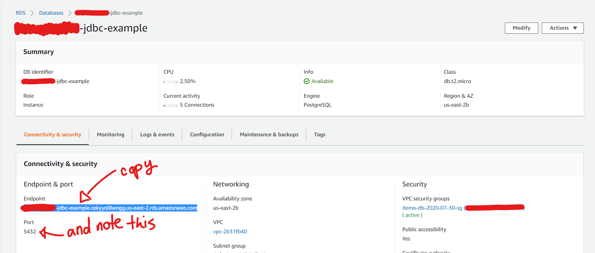
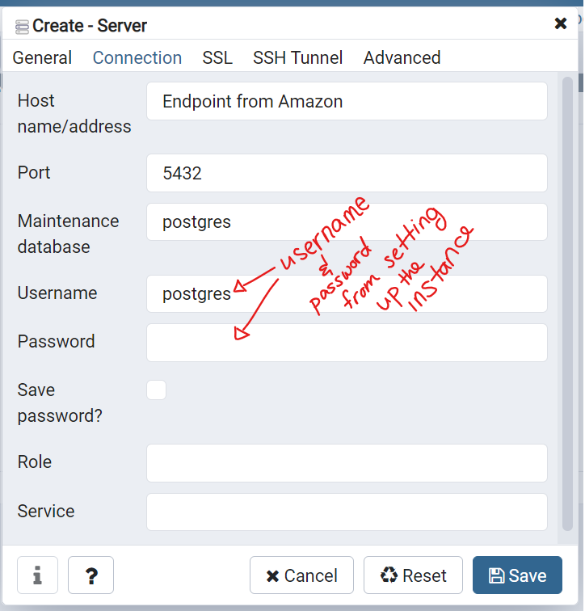

# JDBC Example
The code examples are located under the `jdbc-aws-postgres` folder organized as a Maven project.
**Currently, this project is using a Java 8 environment.**

## Overview
Celebrity example
  * JDBC
  * DAO
  * AWS
  * (Assumes basic familiarity with Oracle/RDMS's and SQL) 

## Setup: 

**Background**

Ensure that you can set up the JDBC-Local Maven Project in Eclipse: 

1. Clone the repo. (You likely have already done this.) 
2. Ensure Maven is properly installed on your machine. 
	1. Download and install from [here](https://maven.apache.org/download.cgi). Installation instructions can be found [here](https://maven.apache.org/install.html) - though essentially you simply unzip the folder. 
	2. Set your environment variables.
3. Ensure that Maven is able to resolve all the dependencies namely the postgresql driver jar and log4j. 
 
**Database Install**

Set up AWS PostgreSQL database.

1. Follow the instructions in the `AWS-flow-postgres-db.pdf` in `jdbc-local\src\main\resources` folder to set up your AWS database.
2. Install pgAdmin. See this [link](https://www.pgadmin.org/download/).  
3. Then connect to your database instance from pgAdmin.
	1. Login to AWS. (Namely the IAM user from which you set up your database.)
	2. Navigate to Services>RDS, and from there select the Databases tab. Then click on the PostgreSQL instance you created. 
	3. At the bottom of the page select the and copy the connection url.
	
	4. From within pgAdmin, right click on Servers>Create>Server. Give your new Server a name and tab over to Connection.
	5. On the Connection tab fill out your credentials: 
	 

After setting up your project in Eclipse you and creating your RDBMS. You'll need to set up your CELEBRITY_DB and its tables. 

## How to teach

### Step 0

Be sure your students have all necessary software properly installed. Help them to set up their personal AWS PostgreSQL databases by sharing the student's AWS pdf in the `jdbc-local\src\main\resources` folder. Then show them how to connect to their database from pgAdmin in the same way that you connected to your own. 

**Database Setup**

In pgAdmin, create the `CELEBRITY_DB` database. You can run the sql in the `setup-db-user.sql` file in the `jdbc-aws-postgres\src\main\resources` folder or you can simply use the pgAdmin wizard. 

In the latter case, right click. Then select Create and then Database. Name it `CELEBRITY_DB`. (Instruct your students to do the same.)  

### Step 1
Create the table in the `CELEBRITY_DB` database. Demo using the `setup-celebrity-tables.sql` code in the `jdbc-local\src\main\resources` folder. 

Be sure and note the types of each field, so you can highlight how they are compatible in the `Celebrity` class you create. 

### Step 2
Create the `Celebrity` class and fill with fields and methods to mirror the `CELEBRITY` table.

### Step 3
Create the `ConnectionUtil` class. Highlight the corresponding postgresql dependency in the `pom.xml`. 

### Step 4
Fill the `ConnectionUtil` class with necessary information while explaining the `Connection` interface and the `DriverManager` class. Create the `getConnection()` method and test it with the main method.

Note that your connection string should be:
1. the protocol `jdbc:postgresql` 
2. the AWS endpoint 
3. the port
4. the database
**"jdbc:postgresql://AWSRDSEndpoint:5432/CELEBRITY_DB"**

### Step 5
Create the `CelebrityRepository` interface and explain the DAO design pattern. Add the abstract methods into the interface.

Leave `insertProcedure` commented out for now. 

### Step 6
Create the `CelebrityRepositoryJdbc` class and implement the `CelebrityRepository` interface.

### Step 7
Implement the `selectAll()` method with a `Statement`. Explain the drawbacks with using this type of statement.

### Step 8
Implement the `findByUsername()` or `insert()` methods with a `PreparedStatement`. Explain the safeguards that are built in to the `PreparedStatement` and notable improvements.

### Step 9
Create a stored procedure in the db. Run the `setup-stored-proc.sql` statements using pgAdmin. 

Then uncomment and implement the `insertProcedure()` method. Explain the syntactical and usage differences between a callable and a prepared statement.

### Step 10
Create the `CelebrityDataAccessTest` class in `src/test/java` and demonstrate to associates how to test the dao layer.

