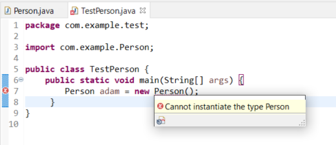
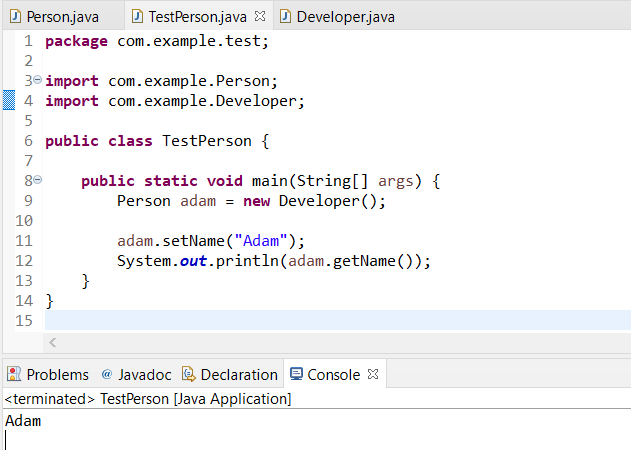

# Abstract Classes

## Objectives

* Explore abstract methods and abstract classes.

## Background

The keyword `abstract` can be applied to a class or a method.

When applied to a method, it specifies to the compiler that the marked method should not have any implementation. The line should end in a semi-colon as opposed to an open curly brace.

```java
public abstract void methodName(...);
```

When you declare a method `abstract`, then its containing class must be declared `abstract` as well. You may, however, declare a class abstract, but not have any abstract methods.

If a class is declared abstract, then it cannot be instantiated. 

## Guided Practice

Below are instructions for you to follow to create a new project that uses an abstract class.

### Project Setup

Open your IDE (Eclipse), and select File > New > Java Project. 

Provide the name, Lab-Abstract-Classes and click Finish.
(Select "Don't Create" if a window comes up asking to "Create a module-info.java" file.) 

Right-click on the newly created project and select New > Package. Provide the package name, com.example. Click Finish. 

Right-click on the newly created package and select New > Class. Provide the class the name, Person and click OK.


### Defining abstract methods
Now edit the file so that it looks like the following:

```java
package com.example;
public class Person{

    protected String name;

    public abstract String getName();

    public abstract void setName(String name);
}
```

Save the file.

Notice that Eclipse displays compiler errors on multiple lines.

Hover your mouse over one of them to see the message:


You'll view, 1 of 3 different messages that all pertain to the fact that we didn't declare Person as `abstract`. Recall that if a class has at least one abstract method, then the class must be declared abstract.


### Defining an abstract class
Update your class to declare it as abstract.

```java
package com.example; 

public abstract class Person{

    protected String name;

    public abstract String getName();

    public abstract void setName(String name);
}
```

Excellent. Save your work.

Now create another package, `com.example.test`. Create a new class called, TestPerson and edit its contents to be like below:

```java
package com.example.test;

import com.example.Person;

public class TestPerson {

    public static void main(String[] args) {
        Person adam = new Person();
    }
}
```

Notice that Eclipse specifies that the Person class cannot be instantiated:



You cannot instantiate an abstract class.

> **So why use an abstract class?**
>
> The major reason is to provide a template for _other_ classes to start from. There is a term called Inheritance which Java supports and this corresponds with allowing classes to _inherit_ or copy properties and behavior from others. In this case, you can define an abstract class as the one to copy from and force developers to write their own version of the class. 

Comment out the line `Person adam = new Person();`, so that it now looks like `//Person adam = new Person();`. 

### Extending an abstract class

Create another class in the com.example package. Call this class Developer. 

Edit the Developer class so that it _extends_ Person. Like so:
```java
package com.example;

public class Developer extends Person {

}
```

This creates an inheritance relationship between Developer and Person. Developer IS-A Person. 

Consequently, the methods and variables declared in Person are passed down, or rather implicitly copied into, Developer.

But what about our _abstract_ methods? 

Even the abstract methods are passed down, which is why you should see a compiler error on the Developer class. 


Recall that unless a class is abstract, it cannot contain abstract methods. This includes classes within an inheritance hierarchy. 

To solve the error we must _override_ the abstract methods in order to implement them.

This will give concrete instructions for the methods that, as of yet, do not have a method body. 

Edit your Developer class to resemble the following:
```java
package com.example;

public class Developer extends Person {

    public String getName() {
        return this.name;
    }

    public void setName(String name) {
        this.name = name; 
    }
}
```

We implemented our abstract methods by defining methods of the same names, same parameters and the same return types as the inherited methods. 

Also notice that we can refer to `name` without re-defining it because Developer inherits the `name` property from Person. 

Wonderful! Let's test our code. 

If you return to TestPerson. You can edit it to resemble the following (we'll remove the commented line from earlier):

```java
package com.example.test;

import com.example.Developer;
import com.example.Person;

public class TestPerson {
	public static void main(String[] args) {
	    Person adam = new Developer();
	    
	    adam.setName("Adam");
	    System.out.println(adam.getName());
	    
	 }
}
```

> Don't forget to add an `import` statement for the Developer class. 

Notice that we assign an instance of Developer to our Person reference. This is how we can indirectly instantiate our abstract classes. This is also an example of Polymorphism another Object Oriented Programming principle-though this is not the focus of this particular lab. 

Finally, when we run our code we see that the methods operate as we defined them to in our Developer class. 



This concludes our lesson. 
