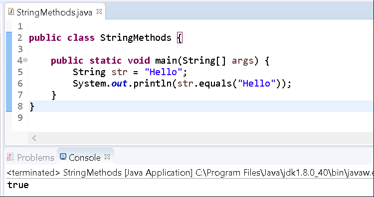
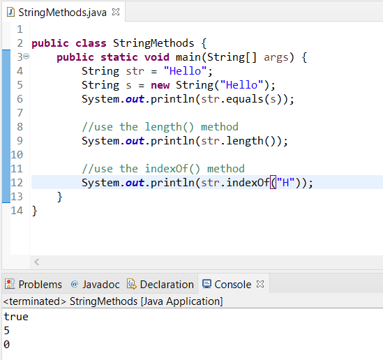

# Common String Methods

## Background

In this exercise, you'll practice using common **methods** of the String class. A method is a block of code that can be referred to by name. It will execute the same functionality whenever invoked (or called). 

All String instances provide methods that you can use to perform common operations such as finding the length of the string, finding the first occurrence of a particular character and more. 

In this guide, we'll use the following methods:

* `equals()`
* `length()`
* `indexOf()`

## Guided Practice

In the following steps, we'll guide you through creating a small program to execute common String methods. 

### Project Setup

1. Open your IDE (Eclipse), and select File > New > Java Project.
2. Provide the name, **Lab-StringMethods** and click **Finish**. 
   a. If a module dialog appears asking to create a module, then click **Don't Create**.  
3. Right-click on the newly created project and select New > Class.  
4. Provide the class the name, StringMethods and click **Finish**.  
5. Now edit the file so that it looks like the following:
    
```java
public class StringMethods {

    public static void main(String[] args) {
        String str = "Hello";
    }
}
```

Let's now practice using some common methods, invoking them from our String variable `str`.  

### equals()

The `equals()` method is used to determine if one String is equivalent to another or not. It accepts a single parameter which should be another String value and returns a `boolean` true if both the argument and the current object are equivalent, false otherwise. 

> It is different from the `==` operator which we won't explore as part of this lab. 

Edit the class to use the `equals()` method to compare the literal value "Hello" to our String variable `str`. 

Your solution should look like the following:

```java
public class StringMethods {

    public static void main(String[] args) {
        String str = "Hello";
        System.out.println(str.equals("Hello"));
    }
}
```

> To invoke a method you must use the **dot operator**. The dot operator is simply a period followed by the name of the method that you use after a class or reference. 

> The `.equals()` method accepts _arguments_ or values that you pass for use in its function. In this case, we told our String variable `str` to compare itself to the passed in value "Hello". In essence, you could read that line of code as, "Run the equals method on our string variable and compare it against the new value 'Hello'". 

Run the program and you'll see that the output of our call to `equals()` is true indicating that the value passed and the reference variable value are the same.



### length()

The `length()` method is used to return the size of the associated String. It accepts 0 parameters and returns an `int` value representing the length (number of characters) of the String.

Edit the class to add an additional print statement that specifies an invocation of `.length()`. Use the `str` variable to invoke the method specifying 0 arguments

Your solution should look like the following. 

```java
public class StringMethods {
    public static void main(String[] args) {
        String str = "Hello";
        String s = new String("Hello");
        System.out.println(str.equals(s));

        //use the length() method
        System.out.println(str.length());
    }
}
```

Run the program and you'll see the output is the number of characters in the String, which is 5.


### indexOf()

The method, `indexOf()` will return the index (zero-based) of the specified character. It specifies an argument that is a single character and returns an `int`. If the character is not within the String, then it will return -1. 

> There are several _overloaded_ forms of the `indexOf()` method. We will focus on only one form that accepts a single String argument. Other forms accept other types of arguments. 

Edit the class to print the index of the letter 'H'. You'll follow the same pattern of using the **dot operator** as you did with the `.equals()` and `.length()` methods. 

```java
public class StringMethods {
    public static void main(String[] args) {
        String str = "Hello";
        String s = new String("Hello");
        System.out.println(str.equals(s));

        //use the length() method
        System.out.println(str.length());

        //use the indexOf() method
        System.out.println(str.indexOf("H"));
    }
}
```

Run the program and you'll find that "H" is at index 0. 



This concludes the lab. 