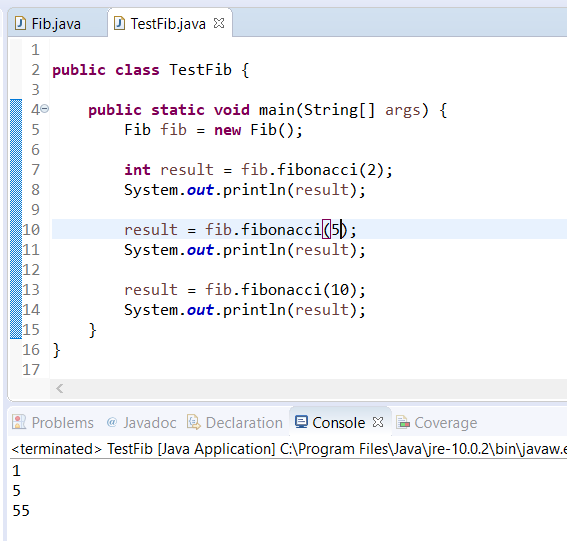

# Factorial 

## Background

Recall that a recursive method is one that calls itself (or a method with the same name). It effectively places a call to itself on the stack of execution.

Typically recursive methods have a base case and the recursive call (the statement that calls itself).

## Instructions

In this lab we'll explore writing an algorithm to compute the Fibonacci sequence of the nth value, where n is a specified parameter.

### Project Setup

1. Open your IDE (Eclipse), and select File > New > Java Project. 
2. Provide the name, Lab-Recursion and click OK. 
3. Right-click on the newly created project and select New > Class 
4. Provide the name Fib for your class. . 
5. Edit its contents so that it resembles the following

```java
public class Fib {

    public int fibonacci(int n){

    }
}
```

Let's review the pseudocode for fibonacci.

```bash
func fib:

 input: x - the position of the fibonacci number
 output: the fibonacci number at position x

 if ( x == 0 ) return 0
 if ( x == 1 ) return 1

return fibonacci(x-1) + fibonacci(x-2)
```

Reading from the pseudocode, we'll need a method that defines an int parameter and returns an `int`. Reviewing our code so far it seems that we're on track.

Now we need to define the base case. In this algorithm we actually have two. If the position is 0, then we'll return 0. If the position is 1, then we'll return 1.

So let's write those in:

```java
public class Fib {

    public int fibonacci(int n){

        if (n == 0) return 0;
        if (n == 1) return 1;
    }
}
```

Now we need to write the recursive step. Looking at the pseudocode we have to return the addition of two numbers. Let's try to write it all in one line just like the pseudocode as opposed to storing the values separately and then summing them and returning that result.

```java
public class Fib {

    public int fibonacci(int n){

        if (n == 0) return 0;
        if (n == 1) return 1;

        return fibonacci(n-1) + fibonacci(n-2);
    }
}
```

It's pretty straightforward, huh?

Now it's time to test your solution. Create a class TestFib and a main method. Then update the class to create an instance of Fib and call the fibonacci method on different values, print them to the console and verify (visually) that you received the correct number.

You'll see output like the following:



This concludes the lab.