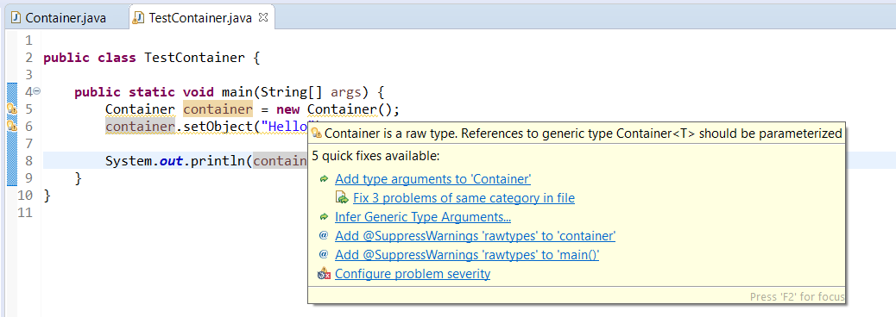

# Generics

## Background

Recall that Generics are a feature set that you can employ to define overall functionality within a class and then restrict the type (also known as type saftety) (at compile time) to whichever type the developer defines.

Generics are commonly employed in Collection interfaces and classes as well as utility classes (a class whose purpose is to house popular functions used in an application).

## Instructions

In this exercise, you'll update a class to utilize generics to enforce type-safety at compile-time.

Company XYZ has a special Container that they have developed. A container support actions for adding an object, viewing what's inside the container, and removing the item from the container. The class is setup like the following:

```java
package com.yourname.model;

public class Container {

    private Object obj;

    public void setObject(Object obj) { this.obj = obj; }

    public Object getObject() { return this.obj; }

    public Object removeObject(){ Object temp = this.obj; obj = null; return temp; }

}
```

Company XYZ has an issue though. They want to restrict the type of items that go in the Container to be of a single type. For example, they don't want to mix Integer with String values. How can you accomplish this?

With Generics of course! (Drum roll)

### Project Setup

1.  Download the project template file from the Reference section (note that you do NOT need to extract all the files from the downloaded zip). Then follow the instructions in the reference section to import the project into Eclipse. 
2.  Right-click on the newly imported project and select New > Package.
3.  Provide the name `com.yourname.model` for your package. Replace "yourname" with your actual firstname.
4.  Drag and drop the Container class from the default package into your newly created package. (Alternatively you can create the class Container and copy the contents from the template Container class into your new Container class. Be sure and delete the Container class from the default package once you're done.). Save your work.

How can you make this class to use generics?

Since we want the entire class and its single property to be constrained to a particular type, we'll first parameterize the class. Do you recall how to do this?

We'll need to choose a letter and enclose it within brackets after the class name.

```java
//Example
public class Container <A> {
  …
}
```

Choosing the letter is important as there are industry conventions that you should follow. Out of the available letters (E, K, V, N, T, S, U), which should you choose?

T, S or U make the most since in this context, since E is for classes that store multiple objects (like Collections), we're not specific to numbers and we're not using key/value pairs.

So your class should look like this:

```java
public class Container<T> {
  …
}
```

That's a great start, but it doesn't really mean anything until we apply this parameterized aspect to fields or methods. Since Company XYZ wants to restrict the type of data that the Container can have, then we should change the Object instance variable to be of type T instead of Object.

Doing so will give us a field like this:

```java
public class Container<T> {

  private T obj;
   …
}
```

Saving your work here, will cause a compiler error in your code. The setObject(...) method reports an error because we're trying to assign a variable of type Object to our variable of type T. Although T is an Object, technically since all classes derive from Object, generics enforces this variable to be of the same type!


So we need to change the parameter of this method to be of type T as well. Make this change. Your code should look like the following:

```java
      ...
    
      public void setObject(T obj) {
    
        this.obj = obj;
    
      }
    
      ...
    }
```

Notice now no compiler errors display when you save your work. Although our code is free of compiler errors we should really continue to parameterize the other methods so that they make use of our `T` type throughout. Otherwise, when the other methods such as `getObject()` are called, they would return something of type `Object` as opposed to what T will resolve to.

Update your code to make use of `T` instead of `Object`. Your code should look like the following:

```java
public class Container<T> {

  private T obj;

  public void setObject(T obj) {
    this.obj = obj;
  }

  public T getObject() {
    return this.obj;
  }

  public T removeObject() {
    T temp = this.obj;
    obj = null;

    return temp;
  }
}
```

Excellent. Now open up the TestContainer class. It should look like this. Be sure and update it. _**The class should either in the same package as your Contianer class or you should import the Container class from com.yourname.model.**_ 

```java
public class TestContainer {

  public static void main(String[] args) {
    Container container = new Container();
    container.setObject("Hello");

    System.out.println(container.getObject());
  }
}
```

Notice that our IDE shows a warning about our code that creates a Container object and executes some of its methods.



Depending on which line of code you hover over, you'll see a message about the class being called as a raw type and the class or the method needing to be parameterized.

Since the `setObject()` method is being called with a String variable, let's parameterize Container for use with Strings.

Update your code to parameterize Container.

Your code should now look like the following:

```java
    Container<String> container = new Container<>();
```

Notice that we used the familiar diamond-syntax as a shortcut on the assignment statement. The diamond-syntax was was introduced during the lessons on Collections. All compiler warnings should disappear and you can now run your class with type-safety assurance.

This concludes this lab