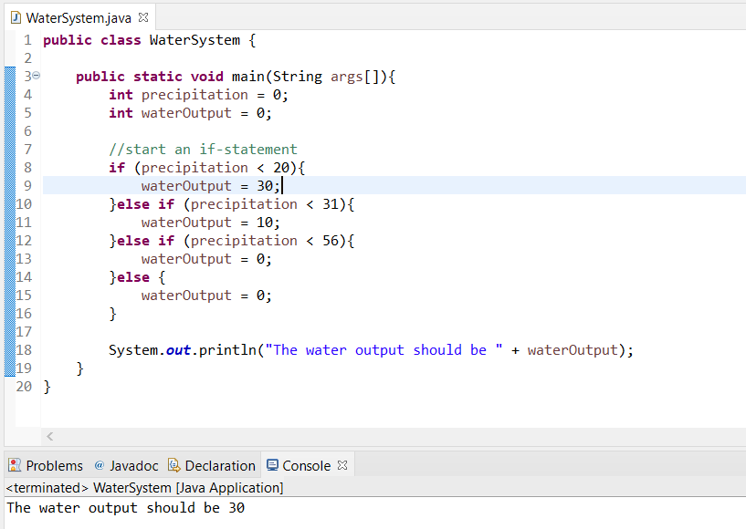
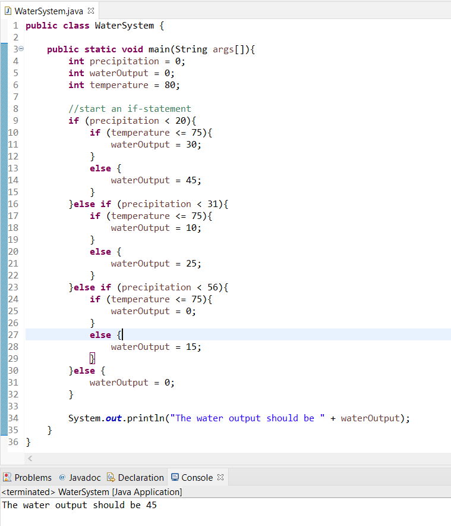

# Nested Conditionals

## Objectives

* Create nested statements that utilize conditional operators.

## Background

A nested statement is one that is defined inside another. Writing statements this way will create a limited context (or scope) for variables and provides a logical container for operations.

For example, look at the following:
```java
if (condition1){
    if (condition2){
        System.out.println("This occurs inside an inner if-statement");
    }
}
```

In the above code, we first begin by defining an if-statement. Immediately, inside of the if-statement, we place another if-statement to create a _nested statement_. This is important because the only way our program will reach the nested statement, is if `condition1` evaluates to **true**. If, it doesn't, then the nested statement will be completely skipped and never evaluated.

## Writing Nested Conditional Statements

You may find yourself in a scenario in which you'll need to create a set of nested conditional statements in order to mimic a series of "if this happens, then do that" type of reasoning. For example, say we need to apply code for an automatic sprinkler system that will spray a specified amount of liters of water based on the chance of rain according to the following table:

| Chance of Rain (%) | Water Output (L) |
| -- | -- |
| 0 - 19 | 30 |
| 20 - 30 | 10 |
| 31-55 | 0 |
| 56 - 100 | 0 |


If we needed to design a program to take in this information and output the necessary water level then we could write something like the following:

### Project Setup

1. Open your IDE (Eclipse), and select File > New > Java Project.
2. Provide the name, _Lab-ConditionalStatements_ and click **Finish**.
   a. If a module dialog appears asking to create a module, then click **Don't Create**. 
3. Right-click on the newly created project and select New > Class.
4. Provide the class the name, WaterSystem and click Finish. 
5. Now edit the file so that it looks like the following:

```java
public class WaterSystem {

    public static void main(String args[]){
        int precipitation = 0;
        int waterOutput = 0;

        //start an if-statement
        if (precipitation < 20){
            waterOutput = 30;
        }else if (precipitation < 31){
            waterOutput = 10; 
        }else if (precipitation < 56){
            waterOutput = 0;
        }else {
            waterOutput = 0;
        }

        System.out.println("The water output should be " + waterOutput);
    }
}
```

If you run the above code and change the precipitation value, then you'll get the expected `waterOutput` as defined by the above scenarios. We correctly modeled our system with a series of if-statements. 



This is a simple example of a chain of conditional statements, but what if we needed to model a more complex situation?

Perhaps we need to also factor in current temperature into our design as follows:

| Chance of Precipitation (%) |  Temperature (F) | Water Output (L) |
| -- | -- | -- |
| 0 - 19 | <= 75 | 30 |
|  |> 75 | 45 | 
| 20 - 30 | <= 75 | 10 |
|  |  > 75 | 25 |
| 31 - 55 | <= 75 | 0 |
| | > 75 |  15 |
| 56 - 100 | <= 75 | 0 |
| | > 75 | 0 |


For each chance of precipitation, there are 2 associated scenarios to determine the water output. One is when the current temperature is less than or equal to 75 degrees, and the other is when the temperature is greater than 75 degrees. 

What updates should you make to your code now in order to correctly model the above scenario?

#### Solution

The first thing we should do is define another variable to capture temperature. We'll define an `int` variable called _temperature_ and provide an arbitrary value of 80. 

```java
public class WaterSystem {

    public static void main(String args[]){
        int precipitation = 0;
        int waterOutput = 0;
        int temperature = 80;
    ...
```

Next, we'll need to add an inner if-statement to each previous conditional statement in order to update our model to consider temperature. We'll start by adding an if-else-statement to the first conditional statement. 

```java
public class WaterSystem {

    public static void main(String args[]){
        int precipitation = 0;
        int waterOutput = 0;
        int temperature = 80;

        //start an if-statement
        if (precipitation < 20){
            if (temperature <= 75){
                waterOutput = 30;
            }
            else {
                waterOutput = 45;
            }
        }
        ...

        System.out.println("The water output should be " + waterOutput);
    }
}
```
Continue to add similar if-else-statements to the other conditional statements to match our model. You should end up with the following:

```java
public class WaterSystem {

    public static void main(String args[]){
        int precipitation = 0;
        int waterOutput = 0;
        int temperature = 80;

        //start an if-statement
        if (precipitation < 20){
        	if (temperature <= 75){
                waterOutput = 30;
            }
            else {
                waterOutput = 45;
            }
        }else if (precipitation < 31){
        	if (temperature <= 75){
                waterOutput = 10;
            }
            else {
                waterOutput = 25;
            } 
        }else if (precipitation < 56){
        	if (temperature <= 75){
                waterOutput = 0;
            }
            else {
                waterOutput = 15;
            }
        }else {
        	waterOutput = 0;
        }
        
        System.out.println("The water output should be " + waterOutput);
    }
}
```
Run the program and you should see that our console displays the correct `waterOutput` value of 45. 



> Try altering the different values of temperature and precipitation to change the program's flow to display and model different values. 

> We didn't need to add a nested conditional to the last scenario (when change of precipitation is greater than or equal to 56) because the water output level is 0 regardless of temperature. 