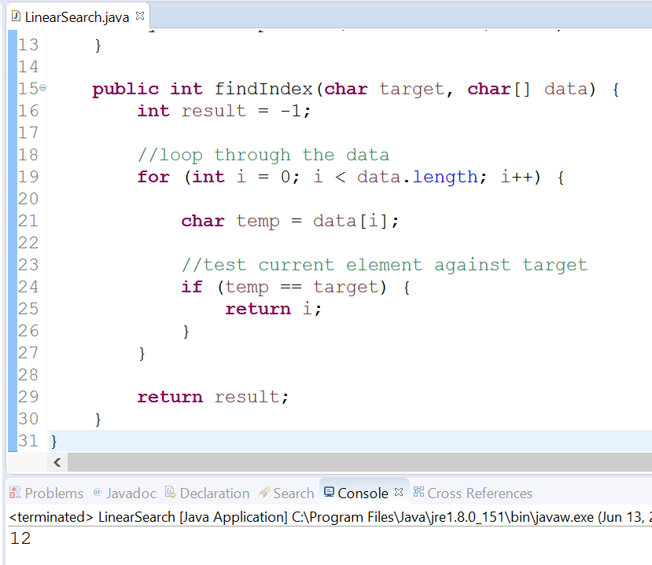
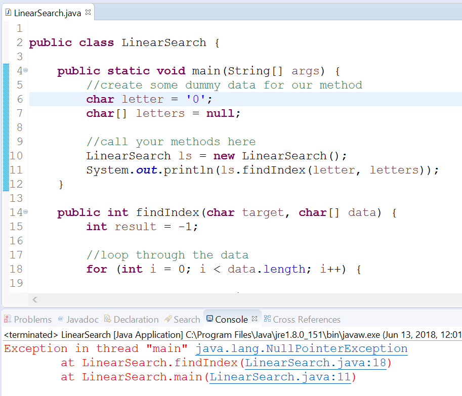

# Writing Search Algorithms

## Objectives

* Explore how write methods that implement search algorithms
    
## Background

In this exercise, you'll practice writing a simple method that can search for a given input in a sorted array of unique values.

## Guided Practice

Follow the instructions below to create a new project. 

### Project Setup

Open your IDE (Eclipse), and select File > New > Java Project.

Provide the name, Lab-SearchAlgorithms and click OK.

Right-click on the newly created project and select New > Class.

Provide the class the name, LinearSearch and click OK.

Now edit the file so that it looks like the following:

```java
public class LinearSearch {

    public static void main(String\[\] args) {
        //create some dummy data for our method
        char\[\] letters = { 'a', 'b', 'c', 'd', 'e', 'f', 'g', 'h', 'i', 'j', 'k', 'l', 'm', 'n', 'o', 'p', 'q', 'r','s', 't', 'u', 'v', 'w', 'x', 'y', 'z' };

        //call your methods here
    }

    //create your first method here
}
```

Now, let's define the signature of our method. We know we need to specify a single `char` type parameter as the target that we're looking for and another parameter for the input data. We also need to return the index of the target, so we need to specify an `int` return type. The method should be available to any class calling it, so we can use public as the access modifier. Thus our method can be:

```java
public int findLetter(char target, char\[\] data)
```

With that, we can start to implement our method. Probably the most straightforward manner is to search each element, one-by-one from the beginning to the end until we find a match. So we can implement that.

The first thing we should decide, however, is what to return if we don't find a match. Typically, in Java, we return -1 as the index of items not found in an array. Since we won't know the size of the input data until the program runs it is not safe to return any positive value (including 0, since arrays start at 0).

Thus, the first thing we should do is setup a variable labeled result and return the value for not matching. Our code should look like the following:

```java
public class LinearSearch {

    public static void main(String\[\] args) {
        //create some dummy data for our method
        char letter = 'm';

        char\[\] letters = { 'a', 'b', 'c', 'd', 'e', 'f', 'g', 'h', 'i', 'j', 'k', 'l', 'm', 'n', 'o', 'p', 'q', 'r', 's', 't', 'u', 'v', 'w', 'x', 'y', 'z' };

        //call your methods here
    }

    //create your first method here
    public static int findIndex(char target, char\[\] data) {
        int result = -1;

        return result;
    }
}
```

Save the file. Now you can focus on the implementation of finding the target element.

When searching through an array, typically you'll use a loop. A for-loop is the default loop of choice for iterating over a collection like an array. Let's start a for-loop. We have to handle all cases (searching through the entire array), so we should create a loop that starts at the first element and goes to the end:

```java
for (int i = 0; i < data.length; i++) {
    …
}
```

Next, we can declare a variable to store the current letter in the iteration

```java
char temp = data\[i\];
```

Afterwards, we need to write an if-statement to test if the current letter matches our target. Because we're dealing with `char` data types, we can use the equality operator (==). If we do find a match, we need to return the current index (which is i).

```java
if ( temp == target ) {
    return i;  //return the current index
}
```

> **TIP**: We don't need to store the current index separately. It is already being tracked via the variable ‘i'.

Excellent. So the entire method should look like this:

```java
public int findIndex(char target, char\[\] data) {
    int result = -1;

    //loop through the data
    for (int i = 0; i < data.length; i++) {
        char temp = data\[i\];
        
        //test current element against target
        if (temp == target) {   
            return i;
        }
    }

    return result;
}
```

Next, we need to update the main method so that we can test `findIndex(..)`. Create an instance of LinearSearch and call the `findIndex(..)` method on it and print the result to the console.

```java
//call your methods here
LinearSearch ls = new LinearSearch();

System.out.println(ls.findIndex(letter, letters));
```

Your entire class should look like the following:

```java
public class LinearSearch {

    public static void main(String\[\] args) {
        //create some dummy data for our method
        char letter = 'm';

        char\[\] letters = { 'a', 'b', 'c', 'd', 'e', 'f', 'g', 'h', 'i', 'j', 'k', 'l', 'm', 'n', 'o', 'p', 'q', 'r', 's', 't', 'u', 'v', 'w', 'x', 'y', 'z' };

        //call your methods here
        LinearSearch ls = new LinearSearch();

        System.out.println(ls.findIndex(letter, letters));
    }

    public int findIndex(char target, char\[\] data) {
        int result = -1;

        //loop through the data
        for (int i = 0; i < data.length; i++) {
            char temp = data\[i\];

            //test current element against target
            if (temp == target) {
                return i;
            }
        }

        return result;
    }
}
```

Now save your file and execute the class. You should see output like the following:



That's good, but we need to check our method a few more times with different inputs to ensure that we have a good solution.

Try changing the value of the `letter` variable to some other ones and check that the output matches what you expect.

### Making your solution robust

What will happen if our method was passed in 0 for the target or null for the data parameter? Well, 0 would be treated as any other element and our solution should return -1. In the other case, our program would throw a NullPointerException (see screenshot).



A `NullPointerException` is a common error that occurs when a program tries to manipulate a value that is uninitialized. To handle this corner case, we can simply add an if-statement to our method to check if the `data` parameter is null. If so, we can immediately return -1 since we know we won't find a match.

Add the following statement as the first line inside of `findIndex(..)`:

```java
if (data == null ) return -1;
```

Your method should now look like the following:

```java
public int findIndex(char target, char\[\] data) {
    if (data == null ) return -1;

    int result = -1;
    
    //loop through the data
    for (int i = 0; i < data.length; i++) {
        char temp = data\[i\];

        //test current element against target
        if (temp == target) {
            return i;
        }
    }

    return result;
}
```

Great. Now if you run the program and pass in null as the value for data, our method will return -1 and the program will not crash. This approach is called making our program _robust_. We can handle any value that is passed to our method. 

TIP: When writing methods that will be called by other classes (especially those written by other developers), it is a good idea to make sure your method won't cause the program to crash because of unexpected input values. You should handle all inputs gracefully.

Congratulations. You have written an algorithm to search through a data set and find the first matching element.

This concludes the lab. 