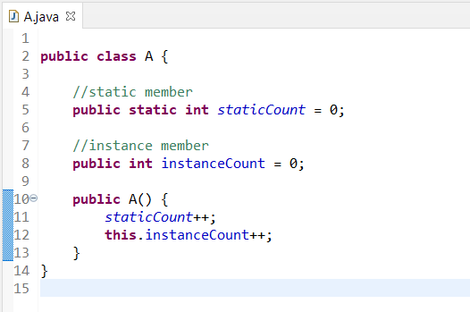
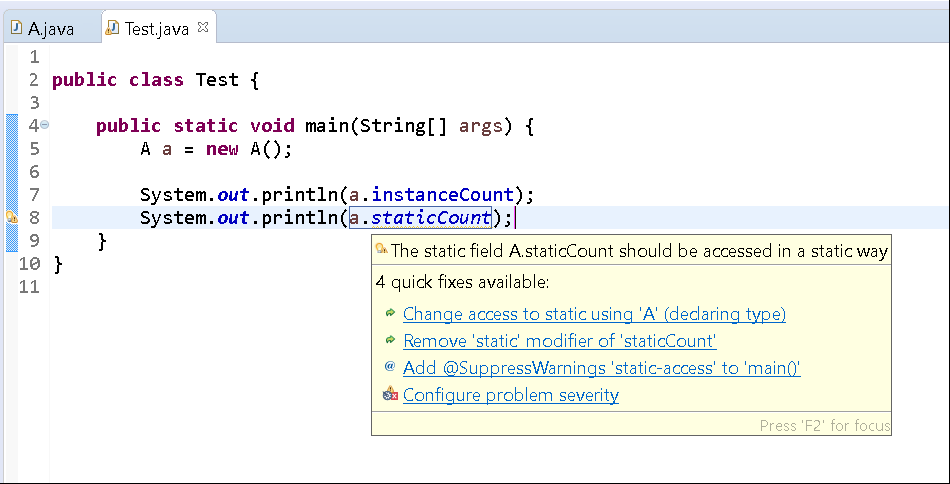
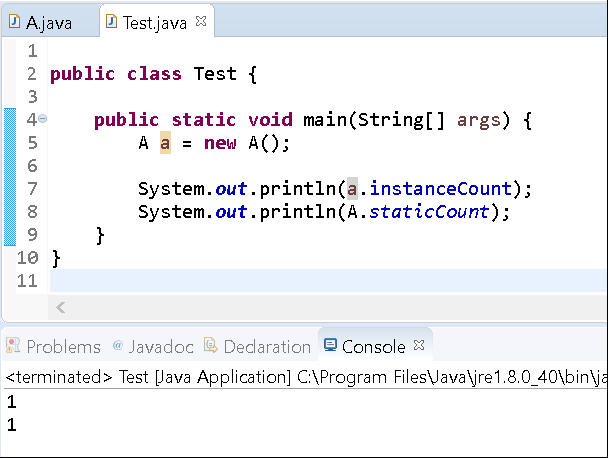
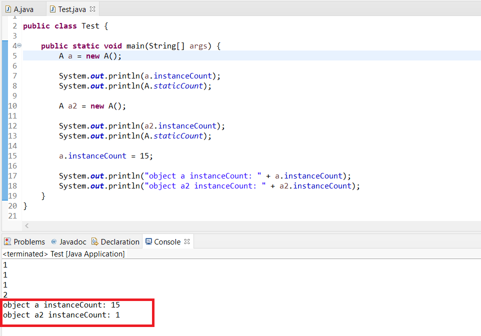
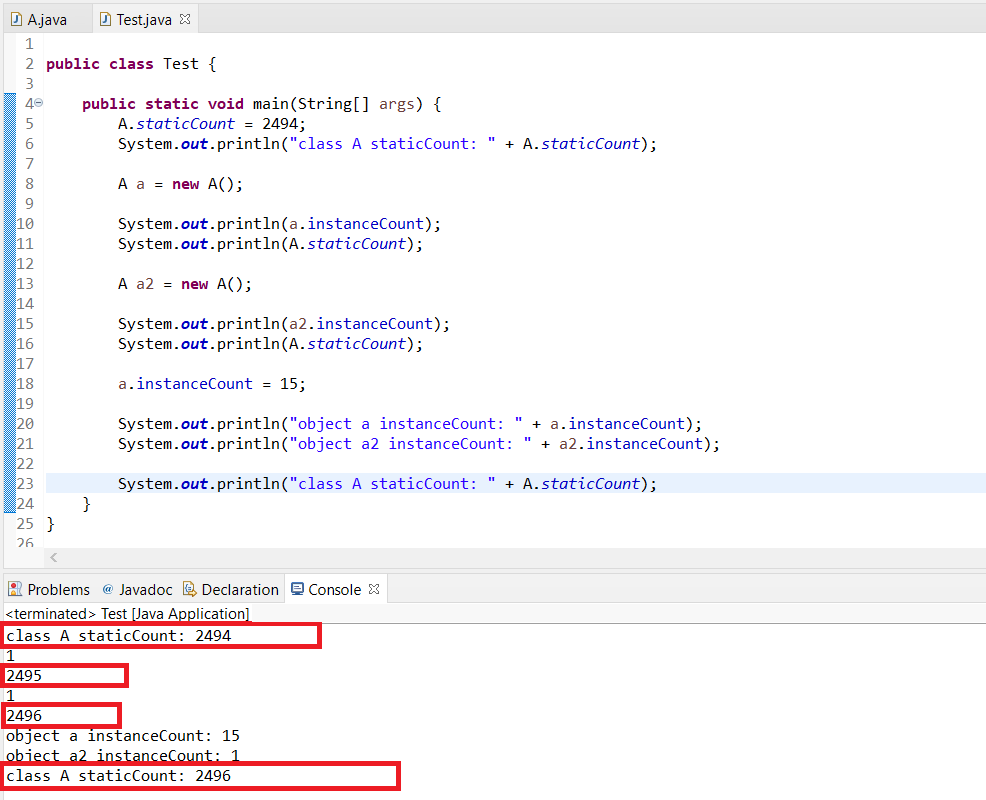

# Static vs Instance

## Objectives

* Understand the difference between static and instance members of a class. 

## Background

A class can declare both static and instance members (variables and methods).

Recall that a _static_ member is shared class-wide, while an _instance_ member is associated with a single instance.

In this exercise we'll explore how the two behave differently when referring to properties and methods.

## Guided Practice

Now that you have some understanding of classes in general, we'll explore creating static and instance members.

Follow the instructions below to create a new project. 

### Project Setup

Open your IDE (Eclipse), and select File > New > Java Project. Provide the name, Lab-Static-vs-Instance and click Finish. 
(Select "Don't Create" if a window comes up asking to "Create a module-info.java" file.) 

Right-click on the newly created project and select New > Class. Provide the class the name, **A** and click Finish.

Now edit the file so that it looks like the following:

```java
public class A {

    //static member
    public static int staticCount = 0;

    //instance member
    public int instanceCount = 0;
}
```

> **NOTE**: The easiest way to tell if a member is _static_ or not is by the keyword `static` being applied to it. It is _static_ if that keyword appears next to it. In this case, `staticCount` is a static property of class **A**.

Now, let's add a no-arg constructor to update both values by one. 

```java
public class A {

    //static member
    public static int staticCount = 0;

    //instance member
    public int instanceCount = 0;

    public A() {
        staticCount++;
        this.instanceCount++;
    }
}
```

Again, notice that the methods that manipulate `staticCount`, have the keyword `static` applied to them. Furthermore, take note that when setting the `staticCount` variable, we don't use the keyword `this`. Instead, we use the class name to refer to it.



## Accessing Static and Instance Members

Now that our class is set up, create another class **Test** (right-click on the project and select New > Class) in which we'll create instances of **A** and see how the different members operate.

Edit your newly create class to resemble the following:

```java
public class Test {

    public static void main(String[] args) {
        A a = new A();

        System.out.println(a.instanceCount);
        System.out.println(a.staticCount);
    }
}
```
Notice how Eclipse underlines `a.staticCount` with a yellow line. When you hover your mouse over the line, you'll see the Eclipse suggestion of "The static field A.staticCount should be accessed in a static way."



Currently, we're trying to access the member from an _instance_ of **A**. Instead, we should specify the class name.

Edit the file to access the field directly from the class as opposed to the instance:

```java
public class Test {

    public static void main(String[] args) {
        A a = new A();

        System.out.println(a.instanceCount);
        System.out.println(A.staticCount);
    }
}
```

Save the file and run the program.

You'll observe output like the following:



In our observance here, we've created an instance of **A** and printed that instance's value for `instanceCount` and we've also accessed the entire class of `A`'s static member `staticCount` and printed its value.

Both are equal to 1.

Now let's create another instance of **A** and perform the same operations. Copy/paste the code you have currently and change the variable name from `a` to `a2` for the new instance.

```java
public class Test {

    public static void main(String[] args) {
        A a = new A();

        System.out.println(a.instanceCount);
        System.out.println(A.staticCount);

        A a2 = new A();

        System.out.println(a2.instanceCount);
        System.out.println(A.staticCount);
    }
}
```

Save the file. 

> Before we run the program, what output do you think will display on the console? 
> Will you see a combination of 1 and 2 or just 1's?


Run the program and you'll observe that the _static_ count for the entire class is now 2.


So this is what separates a static member from an instance one.

Instance members are associated with an _object_ that is saved in memory (basically, whenever we call the `new` keyword we create an object in memory). We can manipulate data for an instance and it won't affect another instance. This is why the variable `a` has an instance count of 1 and the variable `a2` also has an instance count of 1. Both, however, share a static count of 2. 

For example, change the value of the `instanceCount` of reference variable `a` to 15 and print both instance variables (for `a` and `a2`).

Edit your code as follows:

```java
public class Test {

    public static void main(String[] args) {
        A a = new A();

        System.out.println(a.instanceCount);
        System.out.println(A.staticCount);

        A a2 = new A();

        System.out.println(a2.instanceCount);
        System.out.println(A.staticCount);

        a.instanceCount = 15;

        System.out.println("object a instanceCount: " + a.instanceCount);
        System.out.println("object a2 instanceCount: " + a2.instanceCount);
    }
}
```

Run the program and you'll see the following output.



Edit the file to set the variable, `staticCount` by invoking `setStaticCount` with the value 2494 and then print the value to the console. 

```java
public class Test {

    public static void main(String[] args) {
        A.staticCount = 2494;
        System.out.println("class A staticCount: " + A.staticCount);

        A a = new A();

        System.out.println(a.instanceCount);
        System.out.println(A.staticCount);

        A a2 = new A();

        System.out.println(a2.instanceCount);
        System.out.println(A.staticCount);

        a.instanceCount = 15;

        System.out.println("object a instanceCount: " + a.instanceCount);
        System.out.println("object a2 instanceCount: " + a2.instanceCount);
        
        System.out.println("class A staticCount: " + A.staticCount);
    }
}
```

Run the program and you'll see output like the following screenshot.



We updated the variable, `staticCount` initially and you can see that each instance created adds 1 to the value. In this case, we demonstrated how a static variable is associated directly with the class and shared amongst all instances of a class. 

## Summary

Here we've demonstrated how to update and access static variables. A static variable is associated directly with the class while an instance variable is associated with an actual instance of the class. 

This concludes the lab.