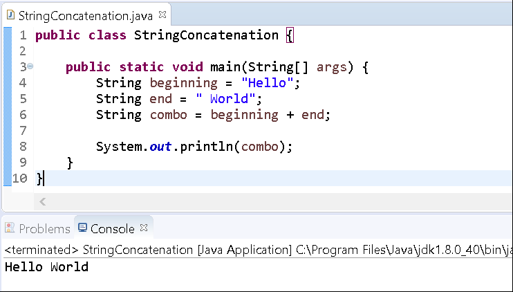
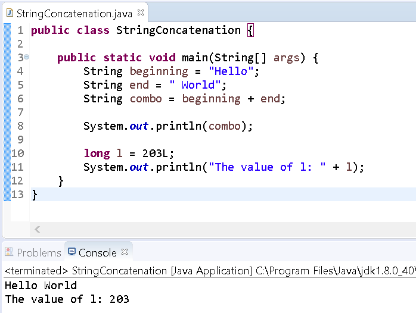
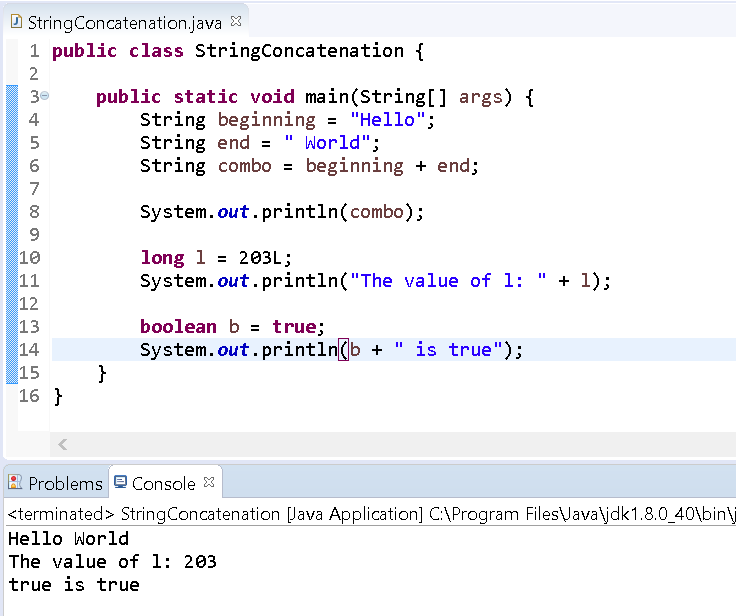
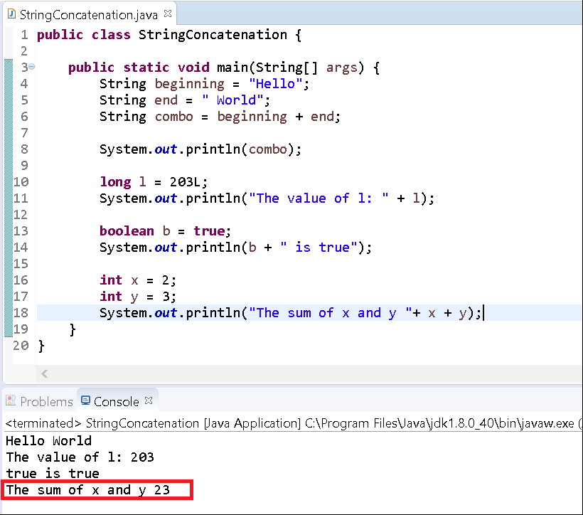
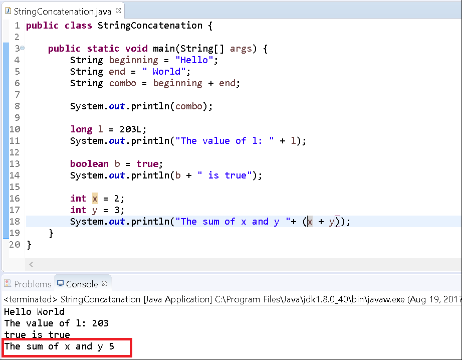
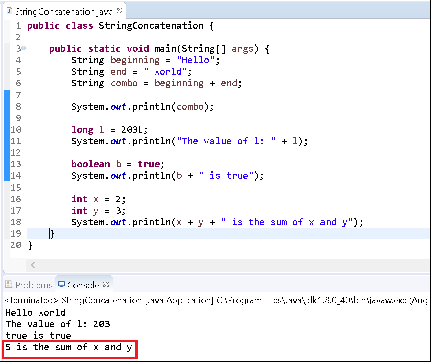

# String Concatenation

## Background

In this exercise, you'll practice string concatenation. Concatenation is the process of combining two strings together using the `+` (plus) operator. You'll often see string concatenation when printing the output of a variable along with a sentence.

For example, say you have the following code snippet:

```java
int x = 2;
String s = "The value of x is " + x;
```

The value of `s` after this snippet executes is, "The value of x is 2". What happens internally is the value of `x` is converted into a `String` and its value is combined with the value of the string "The value of x is ". 

> Notice we left a space after "is" so that the value of `s` would not be "The value of x is2".

Each primitive datatype can be easily embedded into the middle of a string as well. 

Review the following snippet:

```java
int y = 4;
String s = "The number " + y + " is an even number";
```

When executed, the value of `s` will be, "The number 4 is an even number".

## Guided Practice

The following instructions will walk you through creating a simple project that uses string concatenation. 

### Project Setup

1. Open your IDE (Eclipse), and select File > New > Java Project.
2. Provide the name, _Lab-StringConcatenation_ and click **Finish**.
   a. If a module dialog appears, click **Don't Create**. 
3. Right-click on the newly created project and select New > Class.
4. Provide the class the name, StringConcatenation and click **Finish**. 
5. Now edit the file so that it looks like the following:
    
```java
public class StringConcatenation {
    public static void main(String[] args) {
        String beginning = "Hello";

        String end = " World";
        String combo = beginning + end;

        System.out.println(combo);
    }
}
```

In the program above we define two `String` variables and then combine then into a third one by using the `+` operator. 

Run this program and you'll see that the full value "Hello World" prints to the console.



### Adding a Primitive to a String

Next we'll create a variable of type `long` concatenate it to a string and print the result to the console. Edit the StringConcatenation class to define a `long` with a value of 203L and then print the phrase: "The value of `l`: l" by using concatenation and replacing 'l' with the value of the variable `l`.

Your solution should look like the following:

```java
public class StringConcatenation {
    public static void main(String[] args) {
        String beginning = "Hello";
        String end = " World";
        String combo = beginning + end;

        System.out.println(combo);
        
        long l = 203L;
        System.out.println("The value of l: " + l);
    }
}
```

Run the program and you'll see the output of your variable included with the string.



#### Adding Primitives to the Beginning of a String

You can also add a primitive to the beginning of a `String` or to the middle. 

Create a new variable `b` of type `boolean` and set its value to **true**. The print the phrase "b is true" but use concatenation to replace 'b' with the value of variable `b`. 

Your solution should resemble the following:

```java
public class StringConcatenation {
    public static void main(String[] args) {
        String beginning = "Hello";
        String end = " World";
        String combo = beginning + end;

        System.out.println(combo);

        long l = 203L;
        System.out.println("The value of l: " + l);

        boolean b = true;
        System.out.println(b + " is true");
    }
}
```

Run the program and you'll see the output of our value concatenated with the `String` that we created in the method.



#### Order Matters

So let's try and really stretch concatenation and see what the program will do when we try to have three operands and two are numbers.

Define two additional `int` variables `x` and `y` and assign values of 2 and 3, respectively. Then print them using the statement:

```java
System.out.println("The sum of x and y is " + x + y);
```

Your solution should look like the following:

```java
public class StringConcatenation {
    public static void main(String[] args) {
        String beginning = "Hello";
        String end = " World";
        String combo = beginning + end;

        System.out.println(combo);

        long l = 203L;
        System.out.println("The value of l: " + l);

        boolean b = true;
        System.out.println(b + " is true");

        int x = 2;
        int y = 3;
        System.out.println("The sum of x and y is " + x + y);
    }
}
```

In the above code, we have added `x` and `y` to the string value. What do you think will be the output?

Run the program.

You'll see that the numbers are _not_ added together but simply appended to the string. 



#### Changing Order

We can easily change the precedence of the operators by using an extra set of parenthesis.

Edit the file to use parenthesis so that `x + y` should be is executed first and then appended to the string.

Your solution should look like the following:

```java
public class StringConcatenation {
    public static void main(String[] args) {
        String beginning = "Hello";
        String end = " World";
        String combo = beginning + end;

        System.out.println(combo);

        long l = 203L;
        System.out.println("The value of l: " + l);

        boolean b = true;
        System.out.println(b + " is true");

        int x = 2;
        int y = 3;
        System.out.println("The sum of x and y is " + (x + y));
    }
}
```

Run the program and you'll see that we get the output of the sum of the numbers.



### Changing Order by Position

What would happen if we switched the order of the operands and placed the operation of `x + y` _before_ the string?

We'll replace the previous print statement with:

```java
System.out.println(x + y + " is the sum of x and y");
```

Edit the file to resemble the following:

```java
public class StringConcatenation {
    public static void main(String[] args) {
        String beginning = "Hello";
        String end = " World";
        String combo = beginning + end;

        System.out.println(combo);

        long l = 203L;
        System.out.println("The value of l: " + l);

        boolean b = true;
        System.out.println(b + " is true");

        int x = 2;
        int y = 3;
        System.out.println(x + y + " is the sum of x and y");
    }
}
```

Do you think the number 23 or 5 will display with the rest of the sentence?

Run the program and you'll find the output be the sum of the numbers and not a string concatenation of `2` and `3`. 



> One key point to remember here is that order matters when evaluating the `+` operator to determine if a statement is String concatenation statement or a mathematical sum. An easy rule of thumb is that whatever is on the left-hand side of the `+ `operator determines whether it will be concatenation or a sum.
>
> If the value on the left-hand side is a `String`, then the operation is a `String` concatenation and the resultant value will be a String. If, however, the operand is a number (`short`, `int`, `double`, etc.), then the two will produce a mathematical sum.

This concludes the lab.